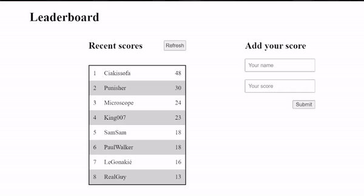

# Leaderboard

> A website displaying scores submitted by different players. It also allows users to add their score. The main goal of this project was to be able to deal with API and play with promises and async/await.

This project was divided into three (3) parts. Refer to the corresponding branch. The branch in bold is the one I am working on. 

1. Basic markup
2. API manipulations
3. **Final touches: styling**

## Live Demo

Here is the link to the live version of this project: [See it live](https://kingjosh007.github.io/leaderboard/) 

## Getting Started

To get a local copy of this project, do the following: 

1. In your terminal, `cd` to the folder where you want to copy this project.
2. Still in your terminal, type `git@github.com:Kingjosh007/leaderboard.git` 
3. Run `cd leaderboard`
4. Run `npm install && npm start`
5. If your browser doesn't open automatically, open it manually and type `http://localhost:8080/` in the URL bar.

## Screenshot

&nbsp; &nbsp; &nbsp; &nbsp; &nbsp; &nbsp; &nbsp; &nbsp; &nbsp; &nbsp; &nbsp; &nbsp; **(Milestone 2) Hit the API**

## Built With

 &nbsp; &nbsp;   &nbsp; &nbsp;   &nbsp; &nbsp;  &nbsp; &nbsp; 

 &nbsp; &nbsp;  &nbsp; &nbsp;  &nbsp; &nbsp;  

## Author

👤 **King Josaphat Chewa (KJC)**

- GitHub: [@Kingjosh007](https://github.com/Kingjosh007)
- Twitter: [@KingJoChewa](https://twitter.com/KingJoChewa)
- LinkedIn: [LinkedIn](https://www.linkedin.com/in/king-josaphat-chewa-aa154011b/)

## Show your support

Give a ⭐️ if you like this project!

## Acknowledgments

- Heartfelt thanks to [Microverse](https://www.microverse.org/)
- Hat tip to [Sime Basioli](https://unsplash.com/@simebasioli) whose image was used from Unsplash

## 📝 License

This project is [MIT](./MIT.md) licensed.